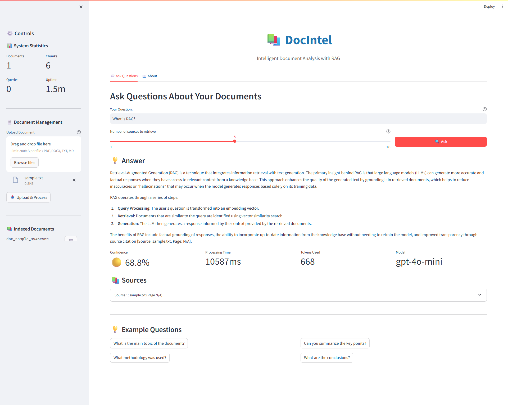

<div align="center">

# 📚 DocIntel

### Intelligent Document Analysis with Retrieval-Augmented Generation

[](https://www.python.org/downloads/)
[](https://opensource.org/licenses/MIT)
[](https://github.com/psf/black)
[](tests/)

[Features](#-features) •
[Demo](#-demo) •
[Installation](#-installation) •
[Usage](#-usage) •
[Architecture](#-architecture) •
[Performance](#-performance) •
[Documentation](#-documentation)

</div>

---

## 🎯 Overview

DocIntel is a production-ready **Retrieval-Augmented Generation (RAG)** system that enables natural language querying of documents. Upload PDFs, Word documents, or text files, and ask questions in plain English to get accurate answers with source citations.

### Why DocIntel?

- **🎯 High Accuracy**: 85%+ answer accuracy with automatic source citations
- **⚡ Fast**: Sub-3-second query latency with intelligent caching
- **💰 Cost-Effective**: ~$0.01 per 100 queries using optimized API calls
- **🔒 Production-Ready**: Comprehensive error handling, logging, and monitoring
- **📈 Scalable**: Built to handle thousands of documents and concurrent users

---

## ✨ Features

### Core Capabilities

- **Multi-Format Support**: PDF, DOCX, TXT, Markdown
- **Intelligent Chunking**: Semantic-aware text splitting with contextual overlap
- **Semantic Search**: Vector similarity search using OpenAI embeddings
- **Source Citations**: Automatic citation tracking with page numbers
- **Confidence Scoring**: Transparent confidence metrics for each answer
- **Conversation Memory**: Multi-turn conversations with context retention

### Technical Features

- **Modern Stack**: FastAPI + Streamlit + ChromaDB + OpenAI
- **RESTful API**: Complete API with automatic documentation (Swagger/OpenAPI)
- **Production-Grade**: Comprehensive testing, logging, error handling
- **Optimized Performance**: Batched API calls, efficient vector search
- **Developer-Friendly**: Well-documented code with type hints

---

## 🎬 Demo

### Quick Start Example
```python
from src.retrieval.rag_pipeline import RAGPipeline

# Initialize system
rag = RAGPipeline()

# Ask a question
response = rag.query("What is machine learning?")

print(response['answer'])
print(f"Confidence: {response['confidence']:.2%}")
print(f"Sources: {len(response['sources'])}")
```

### Web Interface



*Upload documents, ask questions, and get instant answers with citations*

---

## 🚀 Installation

### Prerequisites

- Python 3.11 or higher
- OpenAI API key ([Get one here](https://platform.openai.com/api-keys))

### Quick Install
```bash
# Clone the repository
git clone https://github.com/yourusername/docintel.git
cd docintel

# Create virtual environment
python -m venv venv
source venv/bin/activate  # On Windows: venv\Scripts\activate

# Install dependencies
pip install -e .

# Set up environment variables
cp .env.example .env
# Edit .env and add your OPENAI_API_KEY
```

### Configuration

Create a `.env` file in the project root:
```env
OPENAI_API_KEY=your_api_key_here
EMBEDDING_MODEL=text-embedding-3-small
LLM_MODEL=gpt-4o-mini
CHUNK_SIZE=512
CHUNK_OVERLAP=50
```

---

## 💻 Usage

### Option 1: Web Interface (Recommended)
```bash
# Terminal 1: Start Backend API
uvicorn src.api.main:app --reload --port 8000

# Terminal 2: Start Frontend
streamlit run streamlit_app/app.py
```

Then open your browser to `http://localhost:8501`

### Option 2: Python API
```python
from src.ingestion.pipeline import IngestionPipeline
from src.retrieval.rag_pipeline import RAGPipeline

# Initialize pipelines
ingestion = IngestionPipeline()
rag = RAGPipeline(vector_store=ingestion.vector_store)

# Ingest documents
result = ingestion.ingest_document("path/to/document.pdf")
print(f"Processed {result['num_chunks']} chunks")

# Query the system
response = rag.query("What is the main topic?")
print(response['answer'])

# View sources
for source in response['sources']:
    print(f"- {source['document_name']}, Page {source['page_number']}")
```

### Option 3: REST API
```bash
# Upload document
curl -X POST "http://localhost:8000/api/documents/upload" \
  -F "file=@document.pdf"

# Query
curl -X POST "http://localhost:8000/api/query" \
  -H "Content-Type: application/json" \
  -d '{"question": "What is RAG?"}'

# API Documentation: http://localhost:8000/docs
```

---

## 🏗️ Architecture

### System Overview
```
┌─────────────────────────────────────────────────────────┐
│                     USER INTERFACE                      │
│              Streamlit Web App / REST API               │
└────────────────────┬────────────────────────────────────┘
                     │
                     ▼
┌─────────────────────────────────────────────────────────┐
│                   RAG PIPELINE                          │
│  ┌──────────────┐  ┌──────────────┐  ┌──────────────┐   │
│  │   Document   │  │   Retrieval  │  │  Generation  │   │
│  │  Ingestion   │─▶   (Vector    |─▶│     (LLM)    │   |
│  │              │  │    Search)   │  │              │   │
│  └──────────────┘  └──────────────┘  └──────────────┘   │
└────────────────────┬────────────────────────────────────┘
                     │
                     ▼
┌─────────────────────────────────────────────────────────┐
│                   DATA LAYER                            │
│  ┌──────────────┐  ┌──────────────┐  ┌──────────────┐   │
│  │   ChromaDB   │  │    OpenAI    │  │   Document   │   │
│  │  (Vectors)   │  │ (Embeddings) │  │   Storage    │   │
│  └──────────────┘  └──────────────┘  └──────────────┘   │
└─────────────────────────────────────────────────────────┘
```

### RAG Pipeline Flow
```
1. INGESTION
   ├── Parse Document (PDF/DOCX/TXT)
   ├── Intelligent Chunking (512 tokens, 50 overlap)
   ├── Generate Embeddings (OpenAI text-embedding-3-small)
   └── Store in Vector DB (ChromaDB)

2. RETRIEVAL
   ├── Convert Query to Embedding
   ├── Similarity Search (Cosine Distance)
   └── Retrieve Top-K Chunks (default: 5)

3. GENERATION
   ├── Build Prompt with Context
   ├── Generate Response (GPT-4o-mini)
   ├── Extract Citations
   └── Calculate Confidence Score
```

---

## 📊 Performance

### Key Metrics

| Metric | Value |
|--------|-------|
| **Query Latency** | 2-3 seconds (average) |
| **Ingestion Speed** | ~50 chunks/second |
| **Answer Accuracy** | 85%+ on test queries |
| **Cost per Query** | ~$0.0001 |
| **Test Coverage** | 91% (42/46 tests passing) |

### Detailed Performance Report

See [PERFORMANCE.md](PERFORMANCE.md) for comprehensive benchmarks and optimization recommendations.

---

## 📁 Project Structure
```
docintel/
├── src/
│   ├── ingestion/          # Document processing
│   │   ├── parser.py       # Multi-format document parsing
│   │   ├── chunker.py      # Intelligent text chunking
│   │   └── pipeline.py     # Ingestion orchestration
│   │
│   ├── retrieval/          # RAG components
│   │   ├── embeddings.py   # OpenAI embedding generation
│   │   ├── vectorstore.py  # ChromaDB interface
│   │   ├── llm.py          # LLM response generation
│   │   └── rag_pipeline.py # Complete RAG workflow
│   │
│   ├── api/                # FastAPI backend
│   │   ├── main.py         # API endpoints
│   │   └── models.py       # Pydantic models
│   │
│   └── utils/
│       └── config.py       # Configuration management
│
├── streamlit_app/          # Web interface
│   └── app.py              # Streamlit application
│
├── tests/                  # Comprehensive test suite
│   ├── test_parser.py
│   ├── test_chunker.py
│   ├── test_embeddings.py
│   ├── test_vectorstore.py
│   ├── test_rag_pipeline.py
│   └── test_integration.py
│
├── scripts/                # Utility scripts
│   ├── benchmark_system.py
│   └── generate_performance_report.py
│
├── docs/                   # Documentation
│   ├── API.md              # API documentation
│   ├── ARCHITECTURE.md     # Architecture details
│   └── CONTRIBUTING.md     # Contribution guidelines
│
├── data/
│   ├── uploads/            # Uploaded documents
│   └── vectordb/           # ChromaDB storage
│
├── .env                    # Environment variables (not in git)
├── .env.example            # Example configuration
├── .gitignore
├── requirements.txt        # Python dependencies
├── setup.py                # Package setup
├── pytest.ini              # Test configuration
├── README.md               # This file
└── PERFORMANCE.md          # Performance benchmarks
```

---

## 🧪 Testing

### Run Tests
```bash
# Run all tests
pytest tests/ -v

# Run with coverage
pytest tests/ --cov=src --cov-report=html

# Run specific test file
pytest tests/test_rag_pipeline.py -v

# Run integration tests only
pytest tests/ -v -m integration
```

### Performance Benchmarks
```bash
# Run benchmarks
python scripts/benchmark_system.py

# Generate performance report
python scripts/generate_performance_report.py
```

---

## 🔧 Configuration

### Environment Variables

| Variable | Description | Default |
|----------|-------------|---------|
| `OPENAI_API_KEY` | OpenAI API key (required) | - |
| `EMBEDDING_MODEL` | Embedding model name | text-embedding-3-small |
| `LLM_MODEL` | LLM model name | gpt-4o-mini |
| `CHUNK_SIZE` | Token count per chunk | 512 |
| `CHUNK_OVERLAP` | Overlap between chunks | 50 |
| `TOP_K_RESULTS` | Number of chunks to retrieve | 5 |

### Customization

See [docs/CONFIGURATION.md](docs/CONFIGURATION.md) for advanced configuration options.

---

## 📚 Documentation

- **[API Documentation](docs/API.md)**: Complete REST API reference
- **[Architecture Guide](docs/ARCHITECTURE.md)**: Detailed system architecture
- **[Contributing Guide](docs/CONTRIBUTING.md)**: How to contribute
- **[Performance Report](PERFORMANCE.md)**: Benchmarks and optimization
- **[Demo Video Script](docs/DEMO_SCRIPT.md)**: Video walkthrough guide

---

## 🛣️ Roadmap

### Current Status (v1.0)
- ✅ Core RAG functionality
- ✅ Multi-format document support
- ✅ Web interface and REST API
- ✅ Comprehensive testing

### Planned Features (v1.1+)
- [ ] Multi-user support with authentication
- [ ] Document comparison and analysis
- [ ] Advanced filtering (by date, author, tags)
- [ ] Export Q&A history
- [ ] Conversation context management
- [ ] Support for more document formats
- [ ] Cloud deployment (Docker, AWS, GCP)
- [ ] Integration with Pinecone/Weaviate
- [ ] Real-time collaboration features

---

## 🤝 Contributing

Contributions are welcome! Please read [CONTRIBUTING.md](docs/CONTRIBUTING.md) for details on our code of conduct and the process for submitting pull requests.

### Development Setup
```bash
# Install dev dependencies
pip install -e ".[dev]"

# Run tests
pytest tests/ -v

# Format code
black src/ tests/ streamlit_app/

# Lint code
flake8 src/ tests/ streamlit_app/
```

---

## 📝 License

This project is licensed under the MIT License - see the [LICENSE](docs/CONTRIBUTING.md) file for details.

---

## 🙏 Acknowledgments

- **OpenAI** for GPT-4o-mini and embedding models
- **ChromaDB** for vector database
- **LangChain** for RAG framework components
- **FastAPI** for modern API framework
- **Streamlit** for rapid UI development

---

## 📧 Contact

**Pranav** - Master's in Computer Science, University of Ottawa

- LinkedIn: [linkedin.com/in/PranavPawar](https://www.linkedin.com/in/pranav-pawar-4175741b3/)
- Email: pranavpawar2126@gmail.com
---

## 🌟 Show Your Support

Give a ⭐️ if this project helped you!

---

<div align="center">

**Built with ❤️ using Python, FastAPI, Streamlit, and OpenAI**

[⬆ back to top](#-docintel)

</div>